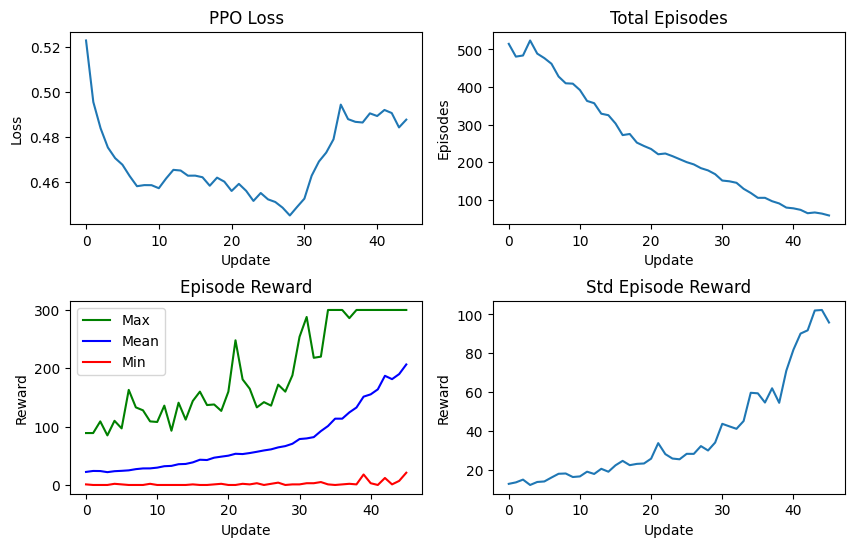
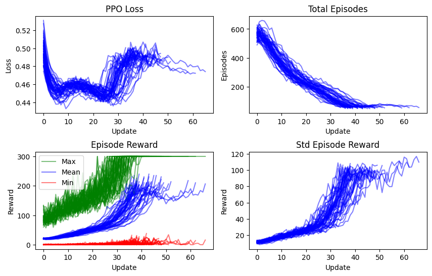

# Fast PPO

Fast PPO is a streamlined implementation of the Proximal Policy Optimization (PPO) algorithm. It leverages multiple CPU cores to gather environment experience more quickly and efficiently.
This implementation can solve the CartPole-v1 environment in less than 5 seconds, utilizing 40 parallel environments running on 20 CPU cores.

## Usage

To train the model, run the following command:

```bash
python train-cartpole.py
```

## Training Output

Here's an example of the output you can expect during training:

```bash
...
Target reward mean of 200 reached! Stopping training...
Setup time: 3.34 seconds
Training time: 4.19 seconds
Updates/second: 8.11
Total time: 7.54 seconds
Returning best actor and critic models with mean episode reward of 206.58
```

## Visualizations

Here's a visualization of the trained model in action:

And here's a plot of the training progress:

By running `benchmark-train-speed.py`, you can execute 50 training sessions. As indicated by the graph below, most of the training sessions converge to the 200 reward mean within the 30-50 actor updates range, which equates to approximately 3-5 seconds.


## TODO

- Add support for Random Network Distillation (RND) for exploration
- Train on sparse reward environments, such as MountainCar-v0
- Add support for continuous action spaces
- Add support for state dependent models, e.g. LSTM
- Train more complex models, such as CNNs, LSTMs, and Transformers
- Train on more complex environments, such as Atari games
- Improve even more the training speed by optimizing as much as possible memory transfers from CPU to GPU and vice versa